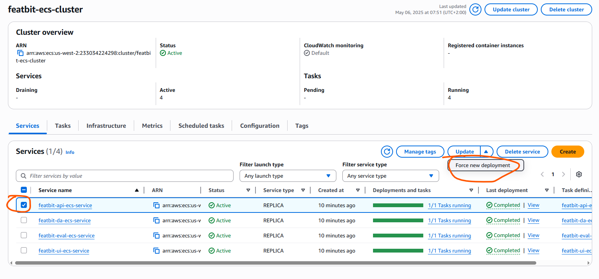

# Introduction
The objective of this project is to deploy FeatBit into AWS, it creates resouces on AWS and then deploy FeatBit docker images from docker hub into AWS ECS.

By default, FeatBit runs on `http`, if you want to run FeatBit on `https`, you will need a certificat and then uncomment **line 113 and line 114** in [file](./modules/ecs-services/main.tf), you will also need to create a data block to fetch the certificat id


# Prerequisites

Before running the project, make sure:

- you have a key pair created on aws, we assurme the key pair `featbit` exists on aws, if you want to use another name for the key pair, please change the value of `key_pair` in the file [variables.tf](./variables.tf).

- you have terraform installed on your local machine

- you have a domain name available, `example.com` for example


# Get started

## Setup aws credentials

You need to setup the AWS credentials on your local machine, please follow the following steps

### Linux

```bash
export AWS_ACCESS_KEY_ID=xxxx
export AWS_SECRET_ACCESS_KEY=yyy
```

### Windows

1. Press Windows Key → search for “Environment Variables”

2. Click “Edit the system environment variables”

3. In the System Properties dialog, click Environment Variables

4. Under User variables (or System variables if for all users):

   - Click New

        - Variable name: AWS_ACCESS_KEY_ID

        - Variable value: your access key ID

   - Do the same for:

        - AWS_SECRET_ACCESS_KEY

5. Click OK on all dialogs.


# Setup aws credentials

## Linux

```bash
export AWS_ACCESS_KEY_ID=
export AWS_SECRET_ACCESS_KEY=
```

## Windows

1. Press Windows Key → search for “Environment Variables”

2. Click “Edit the system environment variables”

3. In the System Properties dialog, click Environment Variables

4. Under User variables (or System variables if for all users):

   - Click New

        - Variable name: AWS_ACCESS_KEY_ID

        - Variable value: your access key ID

   - Do the same for:

        - AWS_SECRET_ACCESS_KEY

5. Click OK on all dialogs.

# Run the project

## Initialize project

```bash
terraform init
```

## Run project

```bash
terraform apply
```

When this step is finished, you will have the following output in the console:
- **cache_host**
- **cache_port**
- **db_host**
- **db_port**
- **jumphost_public_ip**
- **load_balancer_dns**


## Configure your domain

After `Run project` step, you will get the output for the DNS name of the load balancer with name `load_balancer_dns`, add the following CNAME to your domain:

|Type         |Host  |Value                |
|-------------|------|---------------------|
|CNAMNE Record| app  | `LOAD_BALANCER_DNS.`|
|CNAMNE Record| api  | `LOAD_BALANCER_DNS.`|
|CNAMNE Record| eval | `LOAD_BALANCER_DNS.`|
|CNAMNE Record| da   | `LOAD_BALANCER_DNS.`|

**IMPORTANT**: You must add a dot `.` to the end of the `LOAD_BALANCER_DNS`


## Initialize database

After `Run project` step, a jumphost would be created on a EC2 instance, its public IP is availabel in the output with name `jumphost_public_ip`. We can connect to the database and elasticache from local machine via SSH tunnel (you will need your key pair and the jumphost public IP to create the tunnel). 

Once tunnel established, connect to the database with your favorite tool and run the following init scripts against the database

- [b_create_tables.sql](https://github.com/featbit/featbit/blob/main/infra/postgresql/docker-entrypoint-initdb.d/b_create_tables.sql)
- [c_seed_data.sql](https://github.com/featbit/featbit/blob/main/infra/postgresql/docker-entrypoint-initdb.d/c_seed_data.sql)

**NB**: If you cannot connect to elasticache via jumphost, please restart the jumphost EC2 instance

## Redeploy API ECS service

The main services run on AWS ECS, when the database is initialized, you will need to restart the API ECS service to populate the cache

- Open your navigator and log in to AWS Management Console
- Open ECS module and click on the cluster `featbit-ecs-cluster` (it should be **${app_name}-ecs-cluster**)
- In the Services tab, select `featbit-api-ecs-service` and click on `Force new deployment`
 

- The previous step will take some time, when it is done, open a new tab in your navigator and visit the address: `http://app.yourdomain.com`, use the default email and password of FeatBit to log in

## Destroy resources

At the end, if it's only for a test purpose, you can destroy all resources by running `terraform destroy`


# Parameters

By default, the project deploy FeatBit into `us-west-2` region, which is defined in the (variables.tf)[./variables.tf] file, along with other parameters. If you want to any customization, please modify the file directly. 

Most of the parameters in the file can be left as it is, you must specify your values for the following parameters:

- **db_username** : the database username
- **db_password** : the database password
- **key_pair** : the key pair name, you need to create it manually in AWS EC2
- **domain_name** : domain name, this is very important, you must use your domain, other wise it wouldn't work
- **featbit_version**: FeatBit version, the default value is **5.0.2**